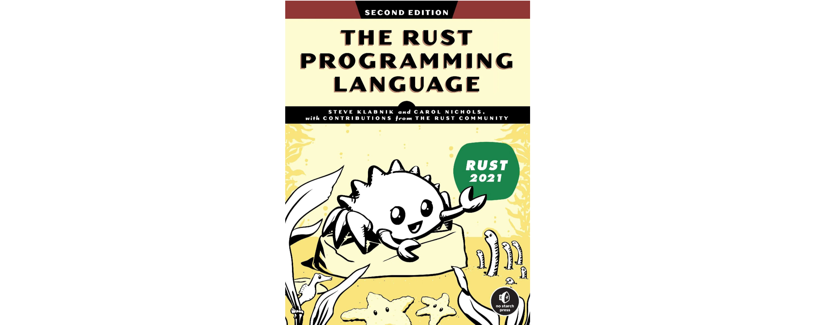

# Preface

---

## Recommended book

- **Recommended book**:
  - [The Rust Programming Language](https://doc.rust-lang.org/book/), Steve Klabnik i Carol Nichols

---

## Other programming books

- _Code Complete: A Practical Handbook of Software Construction, Second Edition_, Steve McConnell
- _The Pragmatic Programmer: Your Journey to Mastery_, David Thomas i Andrew Hunt
- _Clean Code: A Handbook of Agile Software Craftsmanship_, Robert C. Martin

