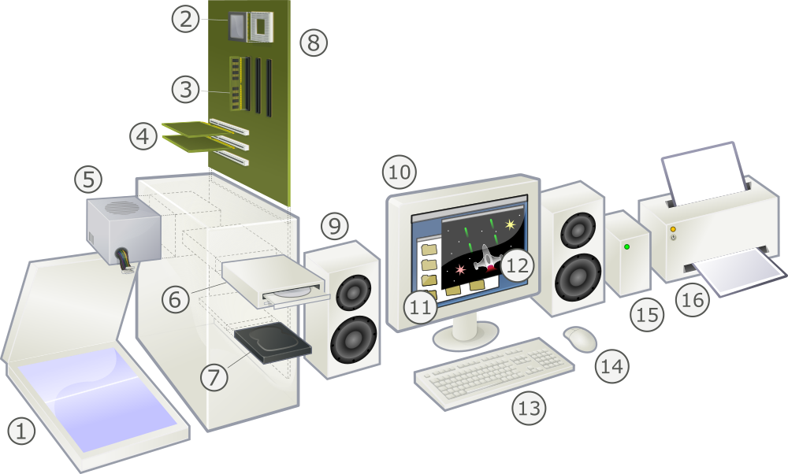

# The Computer's Brain (Hardware vs Software)

---

## 🧠 What's Inside a Computer?

A computer might look like just a box with a screen and keyboard...
But inside, it's full of tiny parts that work together to follow instructions, store data, and show you cool stuff!

---

## 🧱 Two Main Parts

Every computer is made of two main ideas:

### 💾 Hardware

These are the **physical parts** you can touch.

- 🧠 **CPU** (Central Processing Unit): The brain of the computer. It thinks really fast.
- 🧮 **RAM** (Memory): Temporary space to remember things while working.
- 🗃️ **Storage** (like a hard drive): Where files and programs live when you're not using them.
- 🖱️ **Input devices**: Keyboard, mouse, microphone: things you use to _talk_ to the computer.
- 🖥️ **Output devices**: Monitor, speakers, printer: the computer's way to talk back!

---v

---

### 📜 Software

Software is made of **code**: instructions written by humans.

It tells the hardware what to do! Like:

- "Draw a picture"
- "Play a sound"
- "Open this folder"
- "Run this game"

Rust is a language used to write this code. 🦀

---

## 🔁 How It All Works Together

Imagine:

1. You press a key (📥 input)
2. The keyboard sends a message to the CPU (🧠)
3. The CPU checks the program (📜 software)
4. The screen shows a letter (📤 output)

It happens in a blink, but it's all hardware and software working together!

---

## 🧪 Try This!

Think of another machine (like a microwave or robot toy).
Can you name its input, output, memory, and "brain"?

(Write it down or discuss with a friend!)

---

## ✅ Summary

- A computer has **hardware** (the parts) and **software** (the code).
- The **CPU** is the brain. It works with memory and storage to follow instructions.
- You give the computer commands (input) and it gives you results (output).
- With Rust, you'll soon write your own software to control this amazing machine!

Let's explore the filesystem next!
